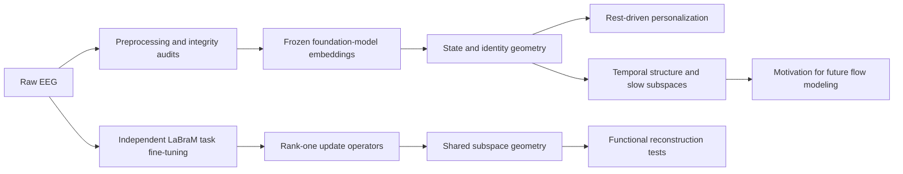

# EEG Foundation Models & Transfer Learning

### SUSTech Research Internship

**Frozen embedding geometry · Rest-driven personalization · Task-conditioned weight updates**

Research code and experimental findings by **Qingyang Ling**.

[CogBCI cross-subject results](Essential%20Codes/CogBCI%20cross-subject%20LDA%2C%20QDA%2C%20Tensor/RESULTS.md) · [ds007554 A/B/C results](Essential%20Codes/ds007554%20Experiments%20A%2CB%2CC/RESULTS.md) · [LaBraM six-spectrum results](Essential%20Codes/LaBraM_TSV_Clean/RESULTS.md)

## Research overview

How much brain-state information do EEG foundation models retain, what prevents it from transferring across people or sessions, and when does shared parameter geometry actually preserve task function?

This collection follows those questions from raw EEG preprocessing and embedding audits to discriminant analysis, temporal structure, rest-based adaptation, and full-fine-tuning update geometry. The experiments span **MEMA, CogBCI, ds007554, and M3CV**. Frozen-embedding comparisons in the three result reports cover **BIOT, LaBraM, CBraMod, EEGPT, and EEGMamba**; some earlier CogBCI scripts also register s-JEPA.

## Featured findings

| Research direction | Finding | Evaluation boundary | Read more |
|---|---|---|---|
| CogBCI cross-subject discriminant geometry | Linear, quadratic-residual, and tensor features have model- and task-dependent effects. Global seven-class bACC spans 34.56%–39.45% across the reported arms. | Four folds holding out complete subjects; task-family readouts and strict seven-class audits are separate. | [Results](Essential%20Codes/CogBCI%20cross-subject%20LDA%2C%20QDA%2C%20Tensor/RESULTS.md) |
| ds007554 static and temporal diagnostics | About 23 Global-SFA axes retain roughly all above-chance Baseline-vs-Task discrimination, while task-identity evidence remains weak. | Three-subject pilot; 171 pooled fold configurations; leave-one-session-out within subject. | [Results](Essential%20Codes/ds007554%20Experiments%20A%2CB%2CC/RESULTS.md) |
| LaBraM/M3CV update geometry | 4%–22% of matrix-wise SVD rank prefixes retain 99% of fitted-model bACC, compared with 67%–75% for 99% update energy. **0/250** projected-overlap curves reach 99% bACC retention. | Five tasks × two independent full-fine-tuning replicates; evaluation on pooled fitted data. | [Results](Essential%20Codes/LaBraM_TSV_Clean/RESULTS.md) |

These are three distinct experimental settings. Their accuracy values measure different questions and should be interpreted within each report's evaluation protocol.

## Explore the code

| Directory | Research role | Documentation |
|---|---|---|
| `MEMA raw data preprocessing & analysis` | Continuous EEG cleaning, labeled HDF5 construction, and trajectory geometry. | [Guide](Essential%20Codes/MEMA%20raw%20data%20preprocessing%20%26%20analysis/README.md) |
| `Embedding extraction & diagnosis` | BIOT embedding extraction and streaming subject-block integrity checks. | [Guide](Essential%20Codes/Embedding%20extraction%20%26%20diagnosis/README.md) |
| `CogBCI 3-class classification older version` | Earlier subject-heldout Rest/N-Back/MATB linear discriminant probes. | [Guide](Essential%20Codes/CogBCI%203-class%20classification%20older%20version/README.md) |
| `CogBCI subject identity classification & rest alignment bottleneck` | State versus subject-identity controls and shared versus task-specific axes. | [Guide](Essential%20Codes/CogBCI%20subject%20identity%20classification%20%26%20rest%20alignment%20bottleneck/README.md) |
| `CogBCI_rest_personalization` | Rest-driven centering, CORAL, and residual-MLP personalization. | [Guide](Essential%20Codes/CogBCI_rest_personalization/README.md) |
| `CogBCI cross-subject LDA, QDA, Tensor` | Seven-state LD/QD/residual/tensor comparison with strict task-family audits. | [Guide](Essential%20Codes/CogBCI%20cross-subject%20LDA%2C%20QDA%2C%20Tensor/README.md) · [Results](Essential%20Codes/CogBCI%20cross-subject%20LDA%2C%20QDA%2C%20Tensor/RESULTS.md) |
| `ds007554 multiclass, pairwise LDA` | Five-state multiclass axes and a named pairwise semantic dictionary. | [Guide](Essential%20Codes/ds007554%20multiclass%2C%20pairwise%20LDA/README.md) |
| `ds007554 Experiments A,B,C` | Static geometry, slow-feature analysis, and frozen slow-space semantic readout. | [Guide](Essential%20Codes/ds007554%20Experiments%20A%2CB%2CC/README.md) · [Results](Essential%20Codes/ds007554%20Experiments%20A%2CB%2CC/RESULTS.md) |
| `LaBraM_TSV_Clean` | Full fine-tuning, heat maps, STI, and six parameter-to-function spectra. | [Original guide](Essential%20Codes/LaBraM_TSV_Clean/README.md) · [Methods](Essential%20Codes/LaBraM_TSV_Clean/METHODS.md) · [Results](Essential%20Codes/LaBraM_TSV_Clean/RESULTS.md) |

## Research workflow

Flow Matching is a proposed downstream direction motivated by the ds007554 diagnostics; the included A/B/C code does not implement a completed Flow Matching model.

## Running the experiments

The source scripts retain their original filenames, contents, and server-path defaults. Directory spelling has been corrected in this repository. The Linux shell launchers require Bash, and data/model paths must be supplied or configured for your own environment. Read the guide in the relevant directory before running.

- **Embedding diagnostics:** NumPy, HDF5 embeddings, and the experiment-specific packages imported by each script. Metadata keys and subject/session grouping must match the input contracts.
- **MEMA preprocessing:** the original [pipeline guide](Essential%20Codes/MEMA%20raw%20data%20preprocessing%20%26%20analysis/MEMA_pipeline_README.md) describes raw EEG layout and dependencies.
- **LaBraM analysis:** the original [README](Essential%20Codes/LaBraM_TSV_Clean/README.md) provides installation, configuration, preflight, training, audit, and analysis commands. Full training and functional inference require the LaBraM implementation, pretrained checkpoint, M3CV HDF5 inputs, and a suitable PyTorch environment.

Raw datasets, embedding archives, model checkpoints, and original result PDFs are external inputs. The published results below are documentation of existing reports; they were not regenerated when assembling this showcase.

## Results and provenance

| Local source report | Markdown adaptation alongside its code |
|---|---|
| `Cross-Subjects LDA与QDA结果.pdf` | [CogBCI RESULTS.md](Essential%20Codes/CogBCI%20cross-subject%20LDA%2C%20QDA%2C%20Tensor/RESULTS.md) |
| `ds007554 embedding analysis report.pdf` | [ds007554 RESULTS.md](Essential%20Codes/ds007554%20Experiments%20A%2CB%2CC/RESULTS.md) |
| `LaBraM_M3CV_Six_Spectra_Academic_Report_20260908.pdf` | [LaBraM/M3CV RESULTS.md](Essential%20Codes/LaBraM_TSV_Clean/RESULTS.md) |

Result tables, mathematical definitions, and interpretation limits have been rewritten in Markdown. Source page references make the adaptations traceable to the local reports. The ds007554 guide also records a residual-definition difference between the presentation and the supplied code.

All **67 original files** under `Essential Codes` are included. Research scripts, configuration files, and tests retain their original bytes; directory spelling and documentation formatting have been corrected. [CODE_SHA256SUMS.txt](CODE_SHA256SUMS.txt) records the current published checksums of those 67 files. Added README and RESULTS files provide navigation and report adaptations around the original research code.
